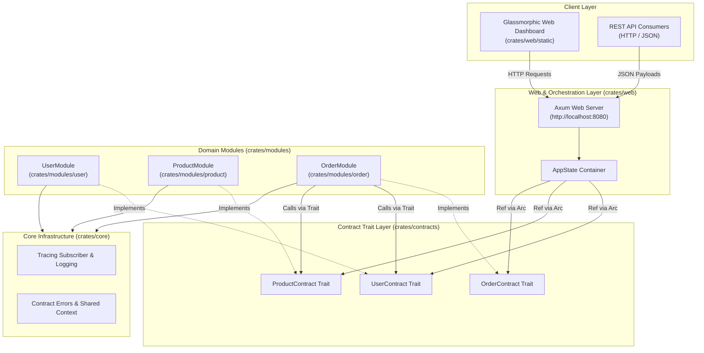

# Program1 — Rust Modular Monolith Engine

> A high-performance, domain-driven **Modular Monolith** application written in Rust using Axum, Tokio, and strict Contract Trait Abstractions.

---

## 📐 Graphify Architecture & Contract Flow



---

## ✨ Features & Highlights

- **Modular Monolith Architecture**: Decoupled domain modules (`User`, `Product`, `Order`) within a single repository and single binary deployment.
- **Contract-Driven Design**: Strict `#[async_trait]` interfaces in `crates/contracts` guarantee zero internal coupling between domain modules.
- **Single-Binary Delivery**: Embedded web UI dashboard and REST API served from one Axum binary.
- **Thread-Safe In-Memory State**: Concurrency handled via Tokio's asynchronous `RwLock` and `Arc`.
- **Rich Dark Glassmorphism UI**: Interactive web interface for testing users, products, and checkout orders in real-time.

---

## 📁 Repository Structure

```
program1/
├── Cargo.toml                  # Cargo Workspace Manifest
├── AGENTS.md                   # Operational guidelines for developers & AI agents
├── README.md                   # Documentation & Graphify Architecture Diagram
└── crates/
    ├── contracts/              # Shared traits (UserContract, ProductContract, OrderContract) & DTOs
    ├── core/                   # Shared logging initialization & error primitives
    ├── modules/
    │   ├── user/               # User domain implementing UserContract
    │   ├── product/            # Product & Stock domain implementing ProductContract
    │   └── order/              # Order domain implementing OrderContract
    └── web/                    # Axum web server orchestrator & static HTML UI
```

---

## 🛠️ REST API Endpoints

| Method | Endpoint | Description |
| :--- | :--- | :--- |
| `GET` | `/health` | Application health status |
| `GET` | `/api/v1/users` | List all users |
| `POST` | `/api/v1/users` | Create a new user |
| `GET` | `/api/v1/users/:id` | Get user details by ID |
| `GET` | `/api/v1/products` | List product catalog |
| `POST` | `/api/v1/products` | Add a new product |
| `GET` | `/api/v1/products/:id` | Get product details by ID |
| `GET` | `/api/v1/orders` | List order ledger |
| `POST` | `/api/v1/orders` | Create an order (validates user & reserves stock) |
| `GET` | `/api/v1/orders/:id` | Get order details by ID |

---

## 🚀 Quick Start

### Prerequisites
- Rust 1.75+ (Cargo)

### Build & Run
1. **Run Unit Tests**:
   ```bash
   cargo test --workspace
   ```

2. **Launch Application**:
   ```bash
   cargo run --package program1-web
   ```

3. **Open Dashboard**:
   Navigate to [http://localhost:8080](http://localhost:8080) in your browser.

---

## 📜 License
MIT License.
