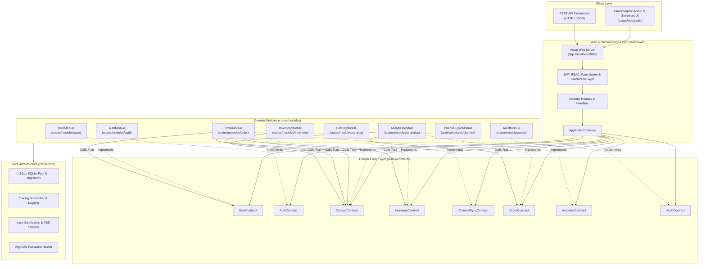

# Program1 — Rust Modular Monolith Engine

> A high-performance, domain-driven **Modular Monolith** application written in Rust using Axum, Tokio, SQLx SQLite persistence, and strict Contract Trait Abstractions.

---

## 📐 Graphify Architecture & Contract Flow



---

## ✨ Features & Highlights

- **Modular Monolith Architecture**: Decoupled domain modules (`User`, `Auth`, `Catalog`, `Inventory`, `Channel`, `Order`, `Analytics`, `Audit`) within a single repository and single binary deployment.
- **Contract-Driven Design**: Strict `#[async_trait]` interfaces in `crates/contracts` guarantee zero direct internal coupling between domain modules.
- **SQLite Persistence & Embedded Migrations**: Managed via SQLx with WAL mode and transaction safety.
- **Argon2id & JWT RBAC**: Enterprise-grade password hashing and role-based access control with JWT middleware.
- **Input Validation & Sanitization**: Strict JSON payload validation returning HTTP 422 with field-level details and HTML sanitization.
- **Rate Limiting & Abuse Protection**: Thread-safe sliding window rate limiting with standard `Retry-After` headers.
- **Audit Logging & Activity Trail**: Immutable activity recording for compliance and administrative oversight.
- **Standardized Error Handling**: RFC-aligned error envelope with typed `ErrorCode` and panic catching middleware.
- **Rich Dark Glassmorphism UI**: Interactive Admin Hub and Customer Storefront.

---

## 📁 Repository Structure

```
program1/
├── Cargo.toml                  # Cargo Workspace Manifest
├── AGENTS.md                   # Operational guidelines & testing rules
├── README.md                   # Architecture documentation & API reference
├── migrations/sqlite/          # Embedded SQLx SQLite schema migrations
└── crates/
    ├── contracts/              # Shared traits (User, Auth, Catalog, Inventory, Order, Audit, etc.) & DTOs
    ├── core/                   # Database init, Argon2id hashing, tracing, sanitization
    ├── modules/
    │   ├── user/               # User management & account persistence
    │   ├── auth/               # JWT token generation & verification
    │   ├── catalog/            # Catalog management & SKU pricing
    │   ├── inventory/          # Ginee OMS multi-warehouse & safety stock tracking
    │   ├── channel/            # Omnichannel marketplace sync (TikTok, Shopee, Tokopedia)
    │   ├── order/              # Checkout processing & stock reservation
    │   ├── analytics/          # Sales metrics & revenue aggregation
    │   └── audit/              # Immutable audit logging & compliance trail
    └── web/                    # Axum orchestrator, handlers, middleware & UI dashboard
```

---

## 🛠️ REST API Endpoints

### Public Endpoints
| Method | Endpoint | Description |
| :--- | :--- | :--- |
| `GET` | `/health` | Application health check |
| `GET` | `/api/v1/store/info` | Store metadata & currency |
| `POST` | `/api/v1/auth/login` | Authenticate user & get JWT token (Rate limited: 5/min) |
| `GET` | `/api/v1/catalog` | List catalog items |
| `GET` | `/api/v1/catalog/:id` | Get catalog item details |
| `POST` | `/api/v1/orders` | Place storefront order (Rate limited: 10/min) |

### Protected Endpoints (JWT Required)
| Method | Endpoint | Description |
| :--- | :--- | :--- |
| `POST` | `/api/v1/catalog` | Create catalog item (Rate limited: 20/min) |
| `GET` | `/api/v1/inventory` | List all inventory stocks & safety levels |
| `GET` | `/api/v1/inventory/:id` | Get inventory stock details |
| `POST` | `/api/v1/inventory/:id/safety-stock` | Update safety stock & record log |
| `GET` | `/api/v1/inventory/:id/safety-stock-logs` | Get safety stock audit trail |
| `GET` | `/api/v1/channels` | List marketplace channel statuses |
| `POST` | `/api/v1/channels/sync/:channel` | Sync inventory stock with external channel |
| `GET` | `/api/v1/orders` | List order history |
| `GET` | `/api/v1/orders/:id` | Get order details |
| `POST` | `/api/v1/orders/marketplace` | Place marketplace order (Rate limited: 10/min) |

### Admin-Only Endpoints (Super Admin Role Required)
| Method | Endpoint | Description |
| :--- | :--- | :--- |
| `POST` | `/api/v1/auth/register` | Register new user account (Rate limited: 3/min) |
| `GET` | `/api/v1/users/accounts` | List user accounts & assigned roles |
| `POST` | `/api/v1/users/accounts` | Create user account |
| `POST` | `/api/v1/users/accounts/:id/permissions` | Update user menu permissions |
| `GET` | `/api/v1/analytics` | Sales analytics & revenue breakdown |
| `GET` | `/api/v1/audit/logs` | Query system audit logs with filters |
| `GET` | `/api/v1/audit/logs/user/:id` | Query audit logs by actor ID |

---

## 🚀 Quick Start

### Prerequisites
- Rust 1.75+ (Cargo)
- Docker & Docker Compose (optional for containerized deployment)

### Build & Run
1. **First-Run Dependency Check**:
   ```bash
   ./scripts/check_dependencies.sh
   ```

2. **Run All Unit & Integration Tests**:
   ```bash
   cargo test --workspace
   ```

3. **Launch Application**:
   ```bash
   cargo run --package program1-web
   ```

4. **Open Dashboards**:
   - Storefront: [http://localhost:8080/store](http://localhost:8080/store)
   - Admin Hub: [http://localhost:8080/admin](http://localhost:8080/admin)

---

## 📜 License
MIT License.
