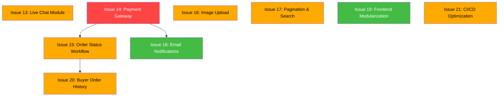

# 📋 Program1 — Development Issue Tracker

> Master index untuk semua issue pengembangan Program1 Modular Monolith.
> Setiap issue dirancang agar bisa dikerjakan secara **independen** oleh programmer junior atau AI agent yang lebih murah.

---

## 🏗️ Arsitektur Saat Ini

```
program1/
├── crates/contracts/       ← Shared trait interfaces & DTOs
├── crates/core/            ← Tracing, DB init, auth helpers (Argon2id)
├── crates/modules/
│   ├── user/               ← UserContract (RBAC, SQLite-backed)
│   ├── auth/               ← AuthContract (JWT HS256)
│   ├── buyer/              ← BuyerContract (Google OAuth, Email/Pass, OTP)
│   ├── catalog/            ← CatalogContract (product catalog, SQLite)
│   ├── inventory/          ← InventoryContract (Ginee OMS multi-stock)
│   ├── channel/            ← ChannelSyncContract (marketplace sync)
│   ├── order/              ← OrderContract (omni-channel orders)
│   ├── analytics/          ← AnalyticsContract (sales analytics)
│   └── audit/              ← AuditContract (immutable audit log)
└── crates/web/             ← Axum HTTP server + static UI (storefront + admin)
```

---

## 🚦 Status & Prioritas Issue

### ✅ Phase 0 — Foundation (DONE)

| # | Issue | Status |
|---|-------|--------|
| 1 | [Authentication & Password Hashing](./issue1_authentication.md) | `[x]` DONE — Argon2id di `core/src/auth.rs`, UserModule uses password_hash |
| 2 | [JWT Middleware & Route Protection](./issue2_jwt_middleware.md) | `[x]` DONE — AuthModule + require_auth/require_buyer_auth/require_admin middleware |
| 3 | [Database Persistence (SQLite)](./issue3_database_persistence.md) | `[x]` DONE — Semua module pakai `sqlx` + 9 migrations |
| 4 | [Input Validation & Sanitization](./issue4_input_validation.md) | `[x]` DONE — `validator` crate + `ValidatedJson` extractor |
| 5 | [CORS Hardening & Security Headers](./issue5_cors_security_headers.md) | `[x]` DONE — CorsLayer + security_headers middleware |
| 6 | [Rate Limiting & Abuse Protection](./issue6_rate_limiting.md) | `[x]` DONE — Per-endpoint IP rate limiting |
| 7 | [Audit Logging & Activity Trail](./issue7_audit_logging.md) | `[x]` DONE — AuditModule + SQLite persistence |
| 8 | [Error Handling Standardization](./issue8_error_handling.md) | `[x]` DONE — ApiError + ErrorCode enum + structured JSON responses |
| 9 | [Legacy Cleanup & Code Hygiene](./issue9_legacy_cleanup.md) | `[x]` DONE — Legacy product module removed |
| 10 | [Environment Config & Secrets Management](./issue10_env_secrets.md) | `[x]` DONE — AppConfig with prod safety checks |
| 11 | [API Versioning & Documentation (OpenAPI)](./issue11_api_docs.md) | `[x]` DONE — utoipa + Swagger UI at /swagger-ui |
| 12 | [Health Check & Observability](./issue12_observability.md) | `[x]` DONE — /health + /health/ready + diagnostics workflow |

### 🆕 Phase 1 — Core E-Commerce Features (NEW)

| # | Issue | Prioritas | Estimasi | Status |
|---|-------|-----------|----------|--------|
| 13 | [Live Chat Module (Backend)](./issue13_live_chat_module.md) | 🟡 HIGH | 3-4 hari | `[ ]` TODO |
| 14 | [Payment Gateway (Midtrans)](./issue14_payment_gateway.md) | 🔴 CRITICAL | 4-5 hari | `[ ]` TODO |
| 15 | [Order Status Workflow & State Machine](./issue15_order_status_workflow.md) | 🟡 HIGH | 2-3 hari | `[ ]` TODO |
| 16 | [Product Image Upload & File Storage](./issue16_image_upload.md) | 🟡 HIGH | 2-3 hari | `[ ]` TODO |
| 17 | [Catalog Pagination, Search & Filtering](./issue17_pagination_search.md) | 🟡 HIGH | 2 hari | `[ ]` TODO |
| 18 | [Email Notification System](./issue18_email_notifications.md) | 🟢 MEDIUM | 2-3 hari | `[ ]` TODO |
| 19 | [Frontend Modularization (JS Refactor)](./issue19_frontend_modularization.md) | 🟢 MEDIUM | 2-3 hari | `[ ]` TODO |
| 20 | [Buyer Order History & Profile Page](./issue20_buyer_order_history.md) | 🟡 HIGH | 2 hari | `[ ]` TODO |
| 21 | [CI/CD Pipeline Optimization](./issue21_cicd_optimization.md) | 🟡 HIGH | 1-2 hari | `[ ]` TODO |

---

## 📐 Dependency Graph (Urutan Pengerjaan Phase 1)



### Urutan yang Disarankan:

1. **Parallel Batch A (Tidak saling depend)**:
   - Issue 13 (Live Chat) — bisa dikerjakan independen
   - Issue 14 (Payment Gateway) — **CRITICAL**, kerjakan pertama
   - Issue 16 (Image Upload) — bisa dikerjakan independen
   - Issue 17 (Pagination) — bisa dikerjakan independen
   - Issue 19 (Frontend Refactor) — bisa dikerjakan independen
   - Issue 21 (CI/CD Optimization) — **KERJAKAN DULUAN** supaya semua issue berikutnya deploy lebih cepat

2. **Sequential Batch B (Depend ke Batch A)**:
   - Issue 15 (Order Status) — depend ke Issue 14
   - Issue 18 (Email Notifications) — depend ke Issue 14
   - Issue 20 (Buyer Order History) — depend ke Issue 15

---

## 📏 Aturan Pengerjaan

1. **Setiap issue adalah Pull Request terpisah** — jangan gabung banyak issue dalam 1 PR
2. **Wajib `cargo test --workspace`** sebelum push — tidak boleh ada test yang gagal
3. **Ikuti Contract Isolation** — modul tidak boleh depend langsung ke internal modul lain
4. **Update `.env.example`** jika menambah environment variable baru
5. **Tulis unit test minimal 1** untuk setiap fitur/fungsi baru
6. **Ikuti aturan AGENTS.md** — No monolithic HTML, no inline Python overwrites

---

## 💰 Estimasi Budget (AI Agent / Junior Dev)

| Batch | Issues | Estimasi Total | Bisa Parallel |
|-------|--------|----------------|---------------|
| A | #13, #14, #16, #17, #19 | 13-17 hari | ✅ Ya (5 orang/agent) |
| B | #15, #18, #20 | 6-8 hari | ⚠️ Sebagian |
| **Total** | **8 issues** | **~19-25 hari** | — |

> Jika dikerjakan oleh 3 junior developer / AI agents secara parallel:
> **Estimasi selesai: ~2-3 minggu**
