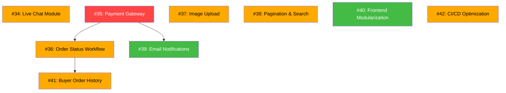
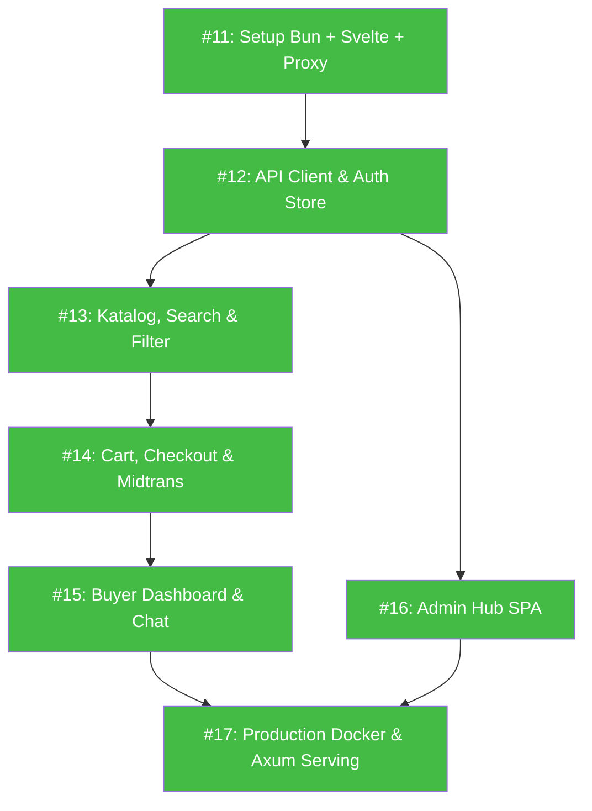

# 📋 Program1 — Development Issue Tracker

> Master index untuk semua issue pengembangan Program1 Modular Monolith.
> Setiap issue dirancang agar bisa dikerjakan secara **independen** oleh programmer junior atau AI agent yang lebih murah.

---

## 🏗️ Arsitektur Saat Ini

```
program1/
├── crates/contracts/       ← Shared trait interfaces & DTOs
├── crates/core/            ← Tracing, DB init, auth helpers (Argon2id)
├── crates/modules/
│   ├── user/               ← UserContract (RBAC, SQLite-backed)
│   ├── auth/               ← AuthContract (JWT HS256)
│   ├── buyer/              ← BuyerContract (Google OAuth, Email/Pass, OTP)
│   ├── catalog/            ← CatalogContract (product catalog, SQLite)
│   ├── inventory/          ← InventoryContract (Ginee OMS multi-stock)
│   ├── channel/            ← ChannelSyncContract (marketplace sync)
│   ├── order/              ← OrderContract (omni-channel orders)
│   ├── analytics/          ← AnalyticsContract (sales analytics)
│   └── audit/              ← AuditContract (immutable audit log)
└── crates/web/             ← Axum HTTP server + static UI (storefront + admin)
```

---

## 🚦 Status & Prioritas Issue

### ✅ Phase 0 — Foundation (DONE)

| # | GitHub Issue | Status |
|---|--------------|--------|
| 1 | [#1 Authentication & Password Hashing](https://github.com/cobacobiy/program1/issues/1) | `[x]` DONE — Argon2id di `core/src/auth.rs`, UserModule uses password_hash |
| 2 | [#2 JWT Middleware & Route Protection](https://github.com/cobacobiy/program1/issues/2) | `[x]` DONE — AuthModule + require_auth/require_buyer_auth/require_admin middleware |
| 3 | [#3 Database Persistence (SQLite)](https://github.com/cobacobiy/program1/issues/3) | `[x]` DONE — Semua module pakai `sqlx` + 9 migrations |
| 4 | [#4 Input Validation & Sanitization](https://github.com/cobacobiy/program1/issues/4) | `[x]` DONE — `validator` crate + `ValidatedJson` extractor |
| 5 | [#5 CORS Hardening & Security Headers](https://github.com/cobacobiy/program1/issues/5) | `[x]` DONE — CorsLayer + security_headers middleware |
| 6 | [#6 Rate Limiting & Abuse Protection](https://github.com/cobacobiy/program1/issues/6) | `[x]` DONE — Per-endpoint IP rate limiting |
| 7 | [#7 Audit Logging & Activity Trail](https://github.com/cobacobiy/program1/issues/7) | `[x]` DONE — AuditModule + SQLite persistence |
| 8 | [#8 Error Handling Standardization](https://github.com/cobacobiy/program1/issues/8) | `[x]` DONE — ApiError + ErrorCode enum + structured JSON responses |
| 9 | [#9 Legacy Cleanup & Code Hygiene](https://github.com/cobacobiy/program1/issues/9) | `[x]` DONE — Legacy product module removed |
| 10 | [#10 Environment Config & Secrets Management](https://github.com/cobacobiy/program1/issues/10) | `[x]` DONE — AppConfig with prod safety checks |
| 11 | [#11 API Versioning & Documentation (OpenAPI)](https://github.com/cobacobiy/program1/issues/11) | `[x]` DONE — utoipa + Swagger UI at /swagger-ui |
| 12 | [#12 Health Check & Observability](https://github.com/cobacobiy/program1/issues/12) | `[x]` DONE — /health + /health/ready + diagnostics workflow |

### 🆕 Phase 1 — Core E-Commerce Features (GitHub Issues #34 – #42)

| Local # | GitHub Issue | Prioritas | Estimasi | Status |
|---------|--------------|-----------|----------|--------|
| 13 | [#34 Live Chat Module (Backend)](https://github.com/cobacobiy/program1/issues/34) | 🟡 HIGH | 3-4 hari | `[x]` DONE (In PR) — Persistent Live Chat module & REST API (#34) |
| 14 | [#35 Payment Gateway Integration (Midtrans)](https://github.com/cobacobiy/program1/issues/35) | 🔴 CRITICAL | 4-5 hari | `[x]` DONE (In PR) — Payment Gateway Integration (Midtrans) |
| 15 | [#36 Order Status Workflow & State Machine](https://github.com/cobacobiy/program1/issues/36) | 🟡 HIGH | 2-3 hari | `[x]` DONE (In PR) — Order Status Workflow & State Machine (#36) |
| 16 | [#37 Product Image Upload & File Storage](https://github.com/cobacobiy/program1/issues/37) | 🟡 HIGH | 2-3 hari | `[x]` DONE (In PR) — Product Image Upload & File Storage (#37) |
| 17 | [#38 Catalog Pagination, Search & Filtering](https://github.com/cobacobiy/program1/issues/38) | 🟡 HIGH | 2 hari | `[x]` DONE (In PR) — Catalog Pagination, Search & Filtering (#38) |
| 18 | [#39 Email Notification System](https://github.com/cobacobiy/program1/issues/39) | 🟢 MEDIUM | 2-3 hari | `[x]` DONE — ConsoleEmailSender + SmtpEmailSender + OrderModule email hooks |
| 19 | [#40 Frontend Modularization (store.js Refactor)](https://github.com/cobacobiy/program1/issues/40) | 🟢 MEDIUM | 2-3 hari | `[x]` DONE — 15 modular JS files in store/ & admin/ |
| 20 | [#41 Buyer Order History & Profile Page](https://github.com/cobacobiy/program1/issues/41) | 🟡 HIGH | 2 hari | `[x]` DONE — Buyer dashboard, order history & profile update |
| 21 | [#42 CI/CD Pipeline Optimization](https://github.com/cobacobiy/program1/issues/42) | 🟡 HIGH | 1-2 hari | `[x]` DONE — Parallel validate + build-ghcr with cargo caching (#43) |

---

## 📐 Dependency Graph (Urutan Pengerjaan Phase 1)



### Urutan yang Disarankan:

1. **Parallel Batch A (Tidak saling depend)**:
   - Issue #34 (Live Chat) — bisa dikerjakan independen
   - Issue #35 (Payment Gateway) — **CRITICAL**, kerjakan pertama
   - Issue #37 (Image Upload) — bisa dikerjakan independen
   - Issue #38 (Pagination) — bisa dikerjakan independen
   - Issue #40 (Frontend Refactor) — bisa dikerjakan independen
   - Issue #42 (CI/CD Optimization) — **KERJAKAN DULUAN** supaya semua issue berikutnya deploy lebih cepat

2. **Sequential Batch B (Depend ke Batch A)**:
   - Issue #36 (Order Status) — depend ke Issue #35
   - Issue #39 (Email Notifications) — depend ke Issue #35
   - Issue #41 (Buyer Order History) — depend ke Issue #36

---

## 📏 Aturan Pengerjaan

1. **Setiap issue adalah Pull Request terpisah** — jangan gabung banyak issue dalam 1 PR
2. **Wajib `cargo test --workspace`** sebelum push — tidak boleh ada test yang gagal
3. **Ikuti Contract Isolation** — modul tidak boleh depend langsung ke internal modul lain
4. **Update `.env.example`** jika menambah environment variable baru
5. **Tulis unit test minimal 1** untuk setiap fitur/fungsi baru
6. **Ikuti aturan AGENTS.md** — No monolithic HTML, no inline Python overwrites

---

### 🚀 Phase 2 — Advanced E-Commerce Features (Issue Guides)

> Setiap issue di bawah punya file panduan step-by-step di folder `issues/`.
> File panduan dirancang agar bisa dikerjakan oleh **junior developer** atau **AI agent murah** secara independen.

| # | Issue Guide | GitHub Issue | Prioritas | Estimasi | Dependency |
|---|-------------|--------------|-----------|----------|------------|
| 1 | [Product Variant Support](issue1-product-variant-support.md) | [#52 Product Variant Support](https://github.com/cobacobiy/program1/issues/52) | 🟡 HIGH | 3-4 hari | `[x]` DONE (In PR) |
| 2 | [Wishlist / Favorite Products](issue2-wishlist-favorite-products.md) | [#53 Wishlist / Favorite Products](https://github.com/cobacobiy/program1/issues/53) | 🟢 MEDIUM | 2-3 hari | Independen |
| 3 | [Kupon Diskon & Promo Code](issue3-coupon-promo-code.md) | [#54 Coupon & Promo Code System](https://github.com/cobacobiy/program1/issues/54) | 🔴 CRITICAL | 3-4 hari | Independen |
| 4 | [Product Review & Rating](issue4-product-review-rating.md) | [#55 Product Review & Rating System](https://github.com/cobacobiy/program1/issues/55) | 🟡 HIGH | 3-4 hari | Order Delivered |
| 5 | [Shipping & Ongkir (RajaOngkir)](issue5-shipping-ongkir-integration.md) | [#56 Shipping / Ongkir Integration](https://github.com/cobacobiy/program1/issues/56) | 🔴 CRITICAL | 4-5 hari | Buyer Address |
| 6 | [Sales Report & Export CSV/PDF](issue6-sales-report-export.md) | [#57 Sales Report & Export CSV/PDF](https://github.com/cobacobiy/program1/issues/57) | 🟡 HIGH | 2-3 hari | Analytics Module |
| 7 | [Product Category & Filtering](issue7-product-category-filtering.md) | [#58 Product Category & Filtering](https://github.com/cobacobiy/program1/issues/58) | 🟡 HIGH | 2-3 hari | Independen |
| 8 | [Multi-Language (i18n)](issue8-multi-language-i18n.md) | [#59 Multi-Language (i18n) Support](https://github.com/cobacobiy/program1/issues/59) | 🟢 MEDIUM | 2-3 hari | Independen |
| 9 | [Notification Center](issue9-notification-center.md) | [#60 Notification Center](https://github.com/cobacobiy/program1/issues/60) | 🟡 HIGH | 3-4 hari | Independen |
| 10 | [Return/Refund Management](issue10-return-refund-management.md) | [#61 Return & Refund Management](https://github.com/cobacobiy/program1/issues/61) | 🔴 CRITICAL | 4-5 hari | Order + Payment |

### Urutan Pengerjaan Phase 2:

1. **Parallel Batch A (Independen — bisa dikerjakan bersamaan)**:
   - Issue 1 (Product Variant)
   - Issue 2 (Wishlist)
   - Issue 3 (Kupon Diskon)
   - Issue 7 (Product Category)
   - Issue 8 (Multi-Language)
   - Issue 9 (Notification Center)

2. **Sequential Batch B (Ada dependency)**:
   - Issue 4 (Review) — butuh order delivered
   - Issue 5 (Shipping) — butuh buyer address
   - Issue 6 (Sales Report) — butuh analytics module
   - Issue 10 (Return/Refund) — butuh order + payment

---

## 💰 Estimasi Budget (AI Agent / Junior Dev)

### Phase 1 (SELESAI ✅)

| Batch | Issues | Estimasi Total | Status |
|-------|--------|----------------|--------|
| A | #34, #35, #37, #38, #40, #42 | 13-17 hari | ✅ DONE |
| B | #36, #39, #41 | 6-8 hari | ✅ DONE |
| **Total Phase 1** | **9 issues** | **~19-25 hari** | ✅ **SELESAI** |

### Phase 2 (IN PROGRESS ⏳)

| Batch | Issues | Estimasi Total | Bisa Parallel |
|-------|--------|----------------|---------------|
| A | Issue 1, 2, 3, 7, 8, 9 | 16-21 hari | ✅ Ya (6 agent) |
| B | Issue 4, 5, 6, 10 | 13-17 hari | ⚠️ Sebagian |
| **Total Phase 2** | **10 issues** | **~29-38 hari** | — |

---

### ⚡ Phase 3 — Frontend Modernization (Svelte 5 + Bun + Vite)

> Mengubah antarmuka web dari file statis HTML/JS lama menjadi **Svelte 5 SPA modern** yang di-bundle dengan **Bun + Vite**, berkomunikasi murni via REST JSON API dengan backend **Rust Axum**, dan tetap mematuhi prinsip **Single Binary Deployment**.

| # | Issue Guide | GitHub Issue | Prioritas | Estimasi | Status |
|---|-------------|--------------|-----------|----------|--------|
| 11 | [Setup Workspace Svelte 5 + Bun & Dev Proxy](issue11-setup-svelte-bun-workspace.md) | [#62 Setup Svelte 5 + Bun Workspace](https://github.com/cobacobiy/program1/issues/62) | 🔴 CRITICAL | 2-3 hari | `[x]` DONE — Bun 1.4 + Svelte 5 + Vite dev proxy (#62) |
| 12 | [Universal API Client, Auth Store & Toast](issue12-svelte-api-client-and-auth.md) | [#63 Universal API Client & Auth Store](https://github.com/cobacobiy/program1/issues/63) | 🔴 CRITICAL | 3-4 hari | `[x]` DONE — Universal apiFetch + auth state + toast stack (#63) |
| 13 | [Katalog Produk, Search & Dynamic Filter](issue13-svelte-catalog-search-filter.md) | [#64 Katalog Produk & Filter](https://github.com/cobacobiy/program1/issues/64) | 🟡 HIGH | 3-4 hari | `[x]` DONE — Live catalog + search filter + category pills (#64) |
| 14 | [Shopping Cart, Checkout & Midtrans Snap](issue14-svelte-cart-checkout-midtrans.md) | [#65 Shopping Cart & Midtrans](https://github.com/cobacobiy/program1/issues/65) | 🔴 CRITICAL | 4-5 hari | `[x]` DONE — Persistent cart drawer + Midtrans Snap popup (#65) |
| 15 | [Buyer Dashboard, Riwayat Order & Live Chat](issue15-svelte-buyer-dashboard-chat.md) | [#66 Buyer Dashboard & Live Chat](https://github.com/cobacobiy/program1/issues/66) | 🟡 HIGH | 3-4 hari | `[x]` DONE — Order tracking modal + Live Chat CS widget (#66) |
| 16 | [Admin Hub SPA (Dashboard, Inventori, Orders)](issue16-svelte-admin-dashboard.md) | [#67 Admin Hub Svelte SPA](https://github.com/cobacobiy/program1/issues/67) | 🟡 HIGH | 4-5 hari | `[x]` DONE — Admin KPI + catalog image upload + order fulfillment (#67) |
| 17 | [Production Multi-stage Docker & Axum SPA Serving](issue17-production-build-and-docker.md) | [#68 Production Docker & Axum Serving](https://github.com/cobacobiy/program1/issues/68) | 🔴 CRITICAL | 3-4 hari | `[x]` DONE — Multi-stage Dockerfile (Bun + Rust) + Axum SPA serving (#68) |

### 📐 Urutan Pengerjaan Phase 3:



### Estimasi & Status Phase 3 (Frontend Modernization):
- **Total Issues:** 7 issues (#11 s/d #17 / GH #62-#68)
- **Status:** ✅ **100% SELESAI & CLOSED DI GITHUB**
- **Semua fitur telah terintegrasi di branch `main`**


