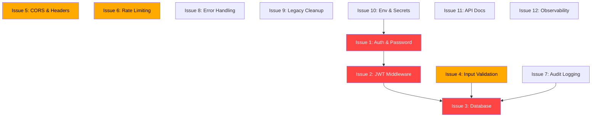

# 📋 Program1 — Development Issue Tracker

> Master index untuk semua issue pengembangan Program1 Modular Monolith.
> Setiap issue dirancang agar bisa dikerjakan secara **independen** oleh programmer junior atau AI agent yang lebih murah.

---

## 🏗️ Arsitektur Saat Ini

```
program1/
├── crates/contracts/       ← Shared trait interfaces & DTOs
├── crates/core/            ← Tracing & shared primitives
├── crates/modules/
│   ├── user/               ← UserContract (RBAC, in-memory)
│   ├── catalog/            ← CatalogContract (product catalog)
│   ├── inventory/          ← InventoryContract (Ginee OMS multi-stock)
│   ├── channel/            ← ChannelSyncContract (marketplace sync)
│   ├── order/              ← OrderContract (omni-channel orders)
│   ├── analytics/          ← AnalyticsContract (sales analytics)
│   └── product/            ← ⚠️ LEGACY — tidak dipakai lagi
└── crates/web/             ← Axum HTTP server + static UI
```

---

## 🚦 Status & Prioritas Issue

| # | Issue | Prioritas | Estimasi | Status |
|---|-------|-----------|----------|--------|
| 1 | [Authentication & Password Hashing](./issue1_authentication.md) | 🔴 CRITICAL | 3-4 hari | `[ ]` TODO |
| 2 | [JWT Middleware & Route Protection](./issue2_jwt_middleware.md) | 🔴 CRITICAL | 2-3 hari | `[ ]` TODO |
| 3 | [Database Persistence (SQLite/PostgreSQL)](./issue3_database_persistence.md) | 🔴 CRITICAL | 4-5 hari | `[ ]` TODO |
| 4 | [Input Validation & Sanitization](./issue4_input_validation.md) | 🟡 HIGH | 2 hari | `[ ]` TODO |
| 5 | [CORS Hardening & Security Headers](./issue5_cors_security_headers.md) | 🟡 HIGH | 1 hari | `[ ]` TODO |
| 6 | [Rate Limiting & Abuse Protection](./issue6_rate_limiting.md) | 🟡 HIGH | 1-2 hari | `[ ]` TODO |
| 7 | [Audit Logging & Activity Trail](./issue7_audit_logging.md) | 🟢 MEDIUM | 2 hari | `[ ]` TODO |
| 8 | [Error Handling Standardization](./issue8_error_handling.md) | 🟢 MEDIUM | 1-2 hari | `[ ]` TODO |
| 9 | [Legacy Cleanup & Code Hygiene](./issue9_legacy_cleanup.md) | 🟢 MEDIUM | 1 hari | `[ ]` TODO |
| 10 | [Environment Config & Secrets Management](./issue10_env_secrets.md) | 🟡 HIGH | 1 hari | `[ ]` TODO |
| 11 | [API Versioning & Documentation (OpenAPI)](./issue11_api_docs.md) | 🟢 MEDIUM | 2 hari | `[ ]` TODO |
| 12 | [Health Check & Observability Enhancement](./issue12_observability.md) | 🟢 MEDIUM | 1-2 hari | `[ ]` TODO |

---

## 📐 Dependency Graph (Urutan Pengerjaan)



### Urutan yang Disarankan:
1. **Phase 1 (Foundation)**: Issue 10 → Issue 1 → Issue 2
2. **Phase 2 (Data Safety)**: Issue 3 → Issue 4 → Issue 8
3. **Phase 3 (Hardening)**: Issue 5 → Issue 6 → Issue 7
4. **Phase 4 (Polish)**: Issue 9 → Issue 11 → Issue 12

---

## 📏 Aturan Pengerjaan

1. **Setiap issue adalah Pull Request terpisah** — jangan gabung banyak issue dalam 1 PR
2. **Wajib `cargo test --workspace`** sebelum push — tidak boleh ada test yang gagal
3. **Ikuti Contract Isolation** — modul tidak boleh depend langsung ke internal modul lain
4. **Update `.env.example`** jika menambah environment variable baru
5. **Tulis unit test minimal 1** untuk setiap fitur/fungsi baru
