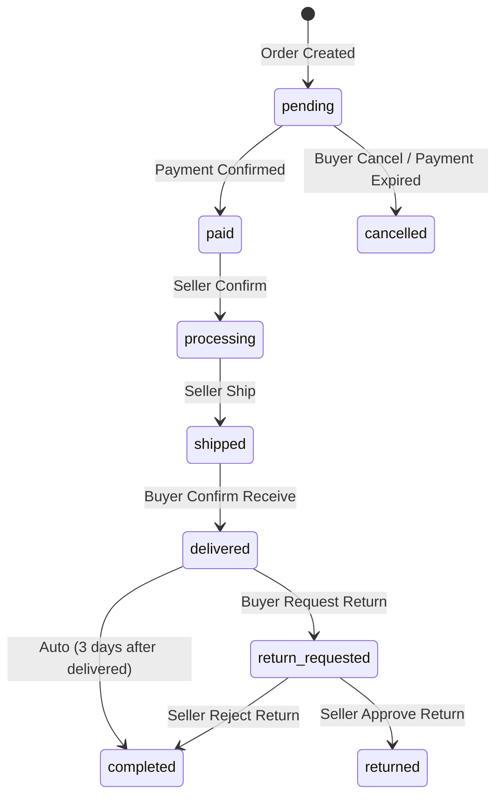

# Issue #15 — Order Status Workflow & State Machine

> **Prioritas**: 🟡 HIGH
> **Estimasi**: 2-3 hari
> **Depends On**: Issue #14 (Payment Gateway)
> **Skill Level**: Junior-Mid Rust Developer

---

## 🔍 Masalah Saat Ini

Order memiliki field `status: String` tapi **tidak ada state machine**. Semua order langsung berstatus `"pending"` dan tidak pernah berubah lagi.

### Status Flow Yang Diharapkan:



---

## ✅ Acceptance Criteria

### Step 1: Definisikan `OrderStatus` enum di `crates/contracts/src/lib.rs`

```rust
#[derive(Debug, Clone, Copy, PartialEq, Eq, Serialize, Deserialize, ToSchema)]
pub enum OrderStatus {
    Pending,
    Paid,
    Processing,
    Shipped,
    Delivered,
    Completed,
    Cancelled,
    ReturnRequested,
    Returned,
}

impl OrderStatus {
    pub fn as_str(&self) -> &'static str { ... }

    /// Valid transitions dari status ini
    pub fn allowed_transitions(&self) -> Vec<OrderStatus> {
        match self {
            Self::Pending => vec![Self::Paid, Self::Cancelled],
            Self::Paid => vec![Self::Processing, Self::Cancelled],
            Self::Processing => vec![Self::Shipped],
            Self::Shipped => vec![Self::Delivered],
            Self::Delivered => vec![Self::Completed, Self::ReturnRequested],
            Self::ReturnRequested => vec![Self::Returned, Self::Completed],
            _ => vec![],
        }
    }

    pub fn can_transition_to(&self, target: &OrderStatus) -> bool {
        self.allowed_transitions().contains(target)
    }
}
```

### Step 2: Tambahkan method `update_order_status` ke `OrderContract`

```rust
#[async_trait]
pub trait OrderContract: Send + Sync {
    // ... existing methods ...

    /// Update order status with transition validation
    async fn update_order_status(
        &self,
        order_id: Uuid,
        new_status: OrderStatus,
        updated_by: &str,
    ) -> Result<OmniOrderDto, ContractError>;
}
```

### Step 3: Implementasi di `crates/modules/order/src/lib.rs`

1. Validasi transisi status menggunakan `can_transition_to()`
2. Jika transisi tidak valid → return `ContractError::ValidationError`
3. Update status di database
4. Log ke `AuditContract` setiap perubahan status

### Step 4: API Endpoints

| Method | Path | Auth | Deskripsi |
|--------|------|------|-----------|
| `PATCH` | `/api/v1/orders/:id/status` | Seller JWT | Seller update status (processing → shipped → etc.) |
| `POST` | `/api/v1/orders/:id/cancel` | Buyer JWT | Buyer cancel order (only if status = pending) |
| `POST` | `/api/v1/orders/:id/confirm-delivery` | Buyer JWT | Buyer confirm barang sudah diterima |

**Request body untuk seller update:**
```json
{
  "new_status": "shipped",
  "tracking_number": "JNT1234567890"
}
```

### Step 5: Tambahkan Migration `012_add_order_tracking.sql`

```sql
ALTER TABLE orders ADD COLUMN tracking_number TEXT;
ALTER TABLE orders ADD COLUMN shipped_at TEXT;
ALTER TABLE orders ADD COLUMN delivered_at TEXT;
ALTER TABLE orders ADD COLUMN cancelled_at TEXT;
ALTER TABLE orders ADD COLUMN cancelled_by TEXT;
ALTER TABLE orders ADD COLUMN cancel_reason TEXT;
```

### Step 6: Frontend Updates

**Admin Panel (`app.js`):**
- Tambahkan tombol "Process", "Ship", "Complete" di order detail view
- Input tracking number saat mark as shipped

**Storefront (`store.js`):**
- Tampilkan order history dengan status badge (warna per status)
- Tombol "Cancel" untuk order pending
- Tombol "Confirm Delivery" untuk order shipped

### Step 7: Unit Tests

1. Test valid transition: `pending → paid → processing → shipped → delivered → completed`
2. Test invalid transition: `pending → shipped` → error
3. Test buyer cancel: only works if status = `pending`
4. Test delivered → completed auto (optional, bisa di-skip dulu)

---

## 📁 File Yang Harus Dibuat/Diubah

| Action | File |
|--------|------|
| **MODIFY** | `crates/contracts/src/lib.rs` (add OrderStatus enum + update_order_status) |
| **MODIFY** | `crates/modules/order/src/lib.rs` (implement status transition) |
| **CREATE** | `migrations/sqlite/012_add_order_tracking.sql` |
| **CREATE** | `crates/web/src/handlers/order_status.rs` (or add to existing order handler) |
| **MODIFY** | `crates/web/src/routes.rs` (add new routes) |
| **MODIFY** | `crates/web/static/store.js` (buyer order history & actions) |
| **MODIFY** | `crates/web/static/app.js` (seller order management) |

---

## ⚠️ Catatan Penting

- **`OrderStatus` disimpan sebagai TEXT di SQLite** — gunakan `as_str()` untuk konversi
- Status transition HARUS di-validate di backend, bukan di frontend saja
- Setiap perubahan status WAJIB diaudit via `AuditContract`
- Pastikan `cargo test --workspace` pass sebelum push
